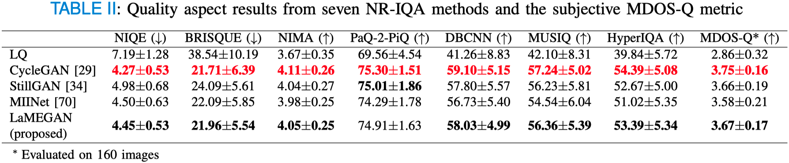
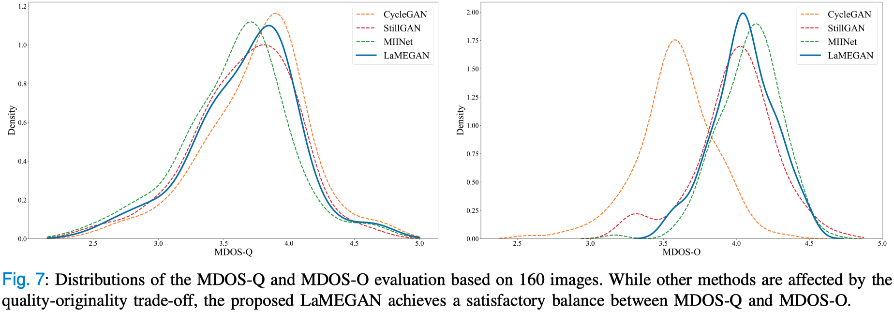

## Prerequisites
- Python >= 3.9
- Poetry >= 2.0
- CUDA 11.8
- CuDNN 9.5

## Getting Started
### Installation
```bash
poetry install --no-root
```

### Training
Prepare the images of two domains A, B then save their full paths to txt files (e.g., `domain_A_train.txt`, `domain_B_train.txt`)

```bash
# examples of domain A image paths
domainA/bad_image_00000.jpg
domainA/bad_image_00002.jpeg
domainA/bad_image_00009.png
domainA/bad_image_00010.jpg
```

```bash
# examples of domain B image paths
domainB/good_image_00200.jpg
domainB/good_image_00101.png
domainB/good_image_00014.jpg
domainB/good_image_00001.jpeg
```

Run the following command to train
```bash
# model options include: cyclegan, lamegan, miinet, stillgan
python train.py --exp_name bad2good --model lamegan \
--path_A domain_A_train.txt \
--path_B domain_B_train.txt \
--load_size_h 270 --load_size_w 480
```

### Testing
```bash
python test.py --exp_name bad2good --model lamegan \
--preprocess resize \
--path_A domain_A_test.txt \
--path_B domain_B_test.txt \
--epoch latest
```

### **Results of LaMEGAN**


