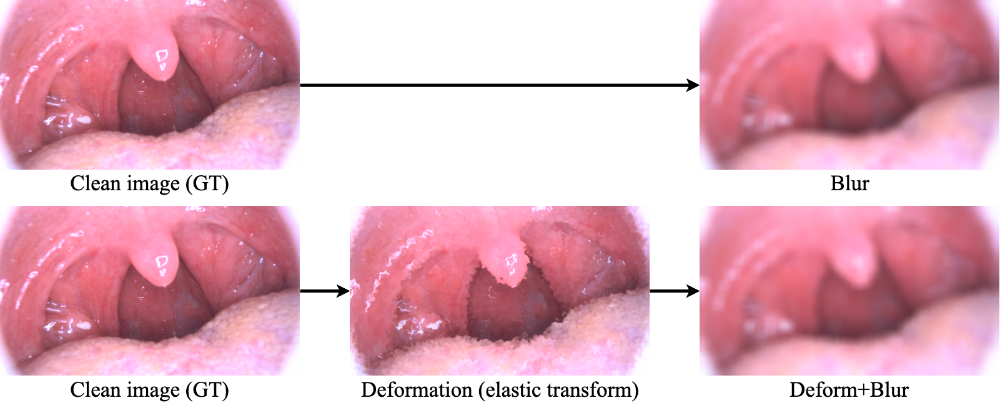
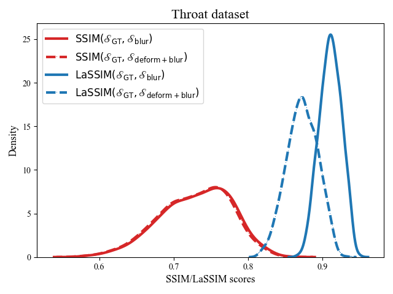
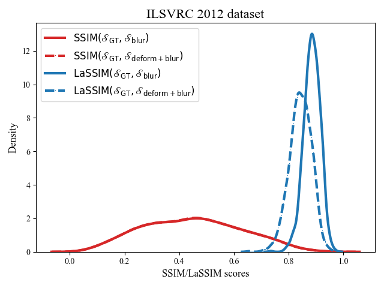
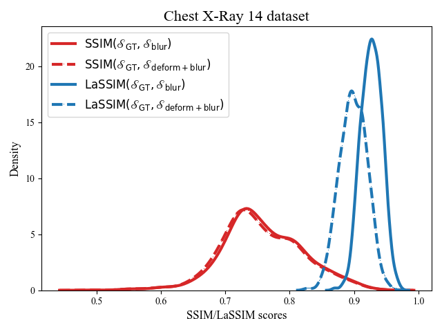
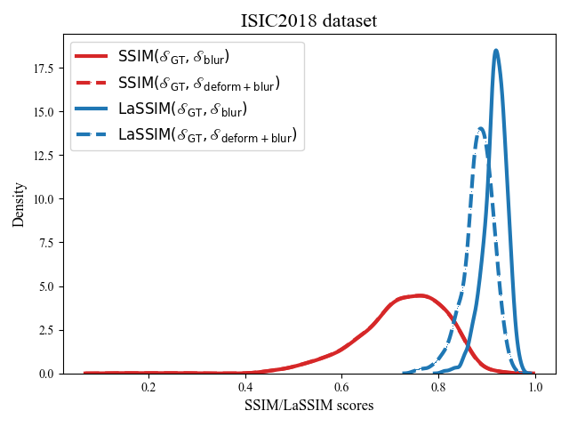
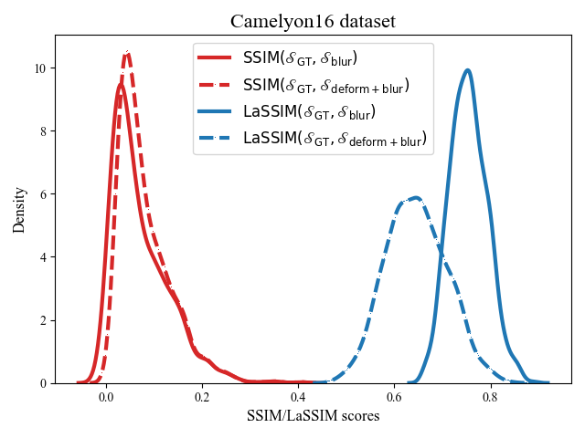

# The Laplacian structural similarity index measurement – LaSSIM

The LaSSIM is an objective evaluation of structural preservation for medical image enhancement tasks that do not require reference images. LaSSIM calculates the SSIM after applying the Laplacian Pyramid (LP) process on both input and output images. The key idea behind LaSSIM is the ability of the LP process to effectively express the global structure of the images under conditions of high image degradation. 

## **Experiment Setups**
Let $f(I, I')$ be an arbitrary measure that evaluates the similarity between images $I$ and $I'$. In addition, let $s\_\mathrm{GT} \in \mathcal{S}\_{\mathrm{GT}}$ be a clean ground-truth image and its two modified versions: one with highly blurred images $s\_\mathrm{blur} \in \mathcal{S}\_{\mathrm{blur}}$ and one with deformed structure and highly blurred images $s\_\mathrm{deform+blur} \in \mathcal{S}\_{\mathrm{deform+blur}}$.  
If $f$ is the desired metric that can capture structural changes, then $f(s\_\mathrm{GT},s\_\mathrm{blur})>f(s\_\mathrm{GT},s\_\mathrm{deform+blur})$ should hold.  
In this experiment, both the SSIM and LaSSIM (with the extracted residual level set to $l = 3$) metrics were validated as $f$.  
In addition, the distribution difference of $\mathbb{F}(\mathcal{S}\_\mathrm{GT}, \mathcal{S}\_\mathrm{blur})$ and $\mathbb{F}(\mathcal{S}\_\mathrm{GT}, \mathcal{S}\_\mathrm{deform+blur})$ on 1,000 images for both SSIM and LaSSIM was evaluated using the Jensen-Shannon divergence.  

### **Images acquisition**
In this experiment, we obtained $\mathcal{S}\_\mathrm{blur}$ and $\mathcal{S}\_\mathrm{deform+blur}$ images using the [Albumentations](https://albumentations.ai/) package (i.e., Blur and ElasticTransform functions, respectively). 

Besides our throat dataset, we also tested the effectiveness of LaSSIM on capturing structural changes on different datasets such as [ImageNet](https://www.image-net.org/challenges/LSVRC/2012/index.php), [ChestX-ray14](https://nihcc.app.box.com/v/ChestXray-NIHCC), [CAMELYON16](https://camelyon16.grand-challenge.org/), and [ISIC2018](https://challenge.isic-archive.com/landing/2018/). 
A total 1,000 images were randomly selected from each of those datasets.  

For the throat dataset, the images were resized to 272x480. The others are resized to 320x320.  

For $\mathcal{S}_\mathrm{blur}$ images, we use three blur levels of 9, 13, and 17 corresponding to low (L), medium (M), and high (H), respectively.  

For $\mathcal{S}_\mathrm{deform+blur}$ images, we use three $\alpha$ levels of 15, 25, and 35 corresponding to low (L), medium (M), and high (H), respectively.  

Below is the step-by-step of obtaining images in our experiment



## How to utilize LaSSIM
Follow the below code block. 
The difference between SSIM scores should be much smaller compared to LaSSIM.
```python
from lassim import LaSSIM, SSIM

# read images
img_ori_path = "resources/image_original.png"
img_blur_path = "resources/image_blur.png"
img_elt_blur_path = "resources/image_elastic_blur.png"

# original image
img_ori = cv2.imread(img_ori_path, -1)
# + blur
img_blur = cv2.imread(img_blur_path, -1)
# + elastic + blur
img_elt_blur = cv2.imread(img_elt_blur_path, -1)

# SSIM in Laplace Pyramid space
lassim_blur_ori = LaSSIM(img_inp=img_blur, img_ref=img_ori)
lassim_elt_blur_ori = LaSSIM(img_inp=img_elt_blur, img_ref=img_ori)

print(f"LaSSIM (blur vs original): {lassim_blur_ori}")
print(f"LaSSIM (elastic+blur vs original): {lassim_elt_blur_ori}\n")

# SSIM in pixel space
ssim_blur_ori = SSIM(img_inp=img_blur, img_ref=img_ori)
ssim_elt_blur_ori = SSIM(img_inp=img_elt_blur, img_ref=img_ori)

print(f"SSIM (blur vs original): {ssim_blur_ori}")
print(f"SSIM (elastic+blur vs original): {ssim_elt_blur_ori}")
```

## **Results**
In this report, we'll show all the results at the distortion level $\lbrack\mathrm{M_{def}}$, $\mathrm{H_{blur}}\rbrack$ (i.e., $\alpha=25$, $\mathrm{blur} = 17$).









