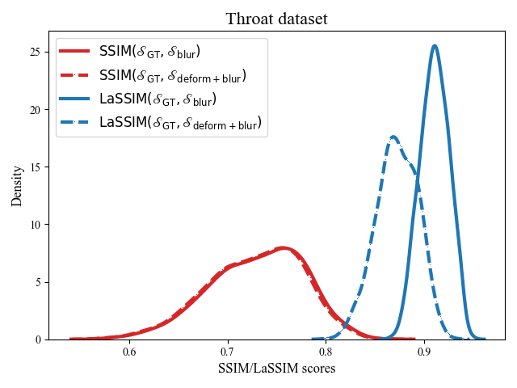
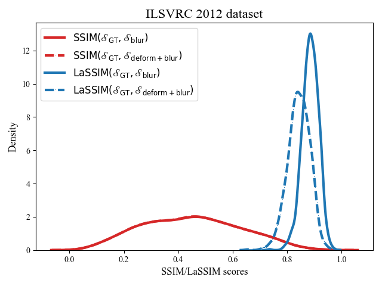
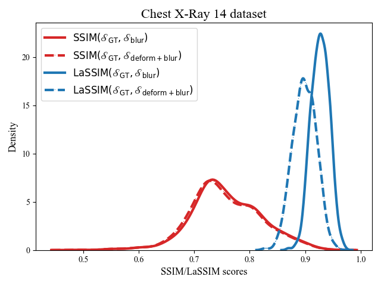
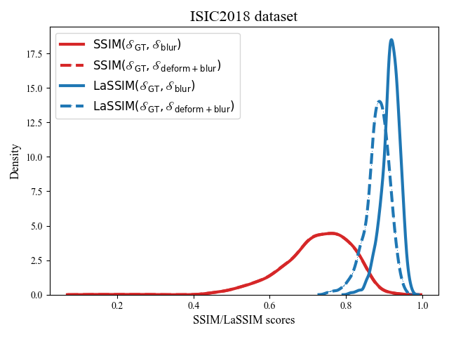
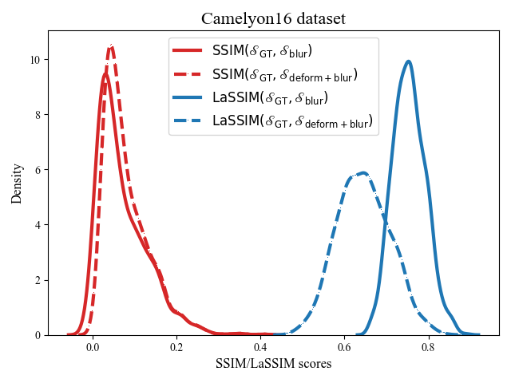

# The Laplacian structural similarity index measurement – LaSSIM

The LaSSIM is an objective evaluation of structural preservation for medical image enhancement tasks that do not require reference images. LaSSIM calculates the SSIM after applying the Laplacian Pyramid (LP) process on both input and output images. The key idea behind LaSSIM is the ability of the LP process to effectively express the global structure of the images under conditions of high image degradation. The figure below shows an example of extracting different LP levels from a clean throat image and its blurred version. In the pixel space (level 0), the SSIM is low due to its vulnerability to blurriness. However, at a certain level of LP space (i.e., level 3), the SSIM between the two images are almost identical.

## **Experiment Setups**
Let $f(x, x')$ be an arbitrary measure that evaluates the similarity between images $x$ and $x'$. In addition, let $s_\mathrm{GT} \in \mathcal{S}_{\mathrm{GT}}$ be a clean ground-truth image and its two modified versions: one with highly blurred images $s_\mathrm{blur} \in \mathcal{S}_{\mathrm{blur}}$ and one with deformed structure and highly blurred images $s_\mathrm{deform+blur} \in \mathcal{S}_{\mathrm{deform+blur}}$.  
If $f$ is the desired metric that can capture structural changes, then $f(s_\mathrm{GT},s_\mathrm{blur})>f(s_\mathrm{GT},s_\mathrm{deform+blur})$ should hold.  
In this experiment, both the SSIM and LaSSIM (with the extracted residual level set to l = 3) metrics were validated as $f$.  
In addition, the distribution difference of $\mathbb{F}(\mathcal{S}_\mathrm{GT}, \mathcal{S}_\mathrm{blur})$ and $\mathbb{F}(\mathcal{S}_\mathrm{GT}, \mathcal{S}_\mathrm{deform+blur})$ on 1,000 images for both SSIM and LaSSIM was evaluated using the Jensen-Shannon divergence.  

### **Images acquisition**
In this experiment, we obtained $\mathcal{S}_\mathrm{blur}$ and $\mathcal{S}_\mathrm{deform+blur}$ images using the [Albumentations](https://albumentations.ai/) package (i.e., Blur and ElasticTransform functions, respectively). 

Besides our throat dataset, we also tested the effectiveness of LaSSIM on capturing structural changes on different datasets such as [ImageNet](https://www.image-net.org/challenges/LSVRC/2012/index.php), [ChestX-ray14](https://nihcc.app.box.com/v/ChestXray-NIHCC), [CAMELYON16](https://camelyon16.grand-challenge.org/), and [ISIC2018](https://challenge.isic-archive.com/landing/2018/). 
A total 1,000 images were randomly selected from each of those datasets.  

For the throat dataset, the images were resized to 272x480. The others are resized to 320x320.  

For $\mathcal{S}_\mathrm{blur}$ images, we use three blur levels of 9, 13, and 17 corresponding to low (L), medium (M), and high (H), respectively.  

For $\mathcal{S}_\mathrm{deform+blur}$ images, we use three $\alpha$ levels of 15, 25, and 35 corresponding to low (L), medium (M), and high (H), respectively. 

## **Results**
In this report, we'll show all the results at the distortion level [$\mathrm{M_{def}}$, $\mathrm{H_{blur}}$].

